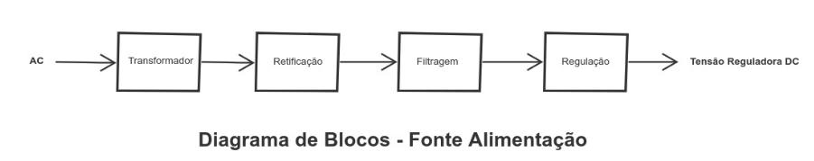
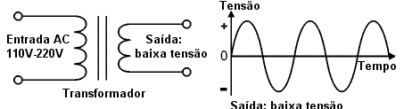
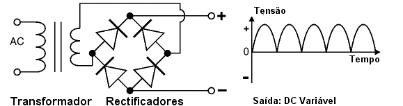
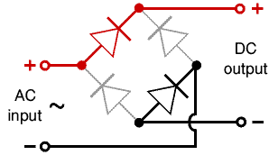

# Objetivo

Nesse projeto, realizado para a disciplina de Eletrônica para Computação do curso da USP - São Carlos, tem-se como objetivo projetar uma **Fonte de Tensão ajustável** entre **3V e 12V** com capacidade de **100mA**   

# Funcionamento 

A fonte transforma a tensão do fornecedor (127V - 220V) em corrente alternada (AC) que, posteriormente, será convertida numa tensão de corrente contínua que permite o funcionamento dos equipamentos. <bt>
  
    

**Transformador:** Converte a tensão recebida (AC) para um valor utilizável em AC.

**Ponte retificadora:** Retifica os pulsos de energia alternada para um sinal contínuo de modo a produzir uma saída polarizada DC.
  
**Filtragem:** Filtra a tensão tornando a corrente contínua.
  
**Regulação:** Regula a saída para obter uma tensão constante.
  
# Etapas 

  1. O processo se inicia com a entrada de um sinal elétrico alternado, em que a DDP será reduzida pelo transformador. Essa etapa é essencial para reduzir o sinal elétrico recebido para uma voltagem utilizável.  
  O transformador é um dispositivo composto por duas bobinas acopladas a um núcleo magnético, que nesse projeto é usado no intuito de reduzir a tensão da tomada para uma que seja utilizável de forma segura pela fonte. Sendo seu funcionamento relacionado ao princípio de indução eltromagnética, no qual a bobina primária ligada na tomada cria um campo magnético que induz uma corrente na bobina secundária. E, como as bobinas possuem quantidades diferentes de espiras, as correntes e voltagens serão diferente de cada lado, para que a potência seja constante. 
  $$Ve.Ns = Vs.Ne$$
Portanto, para transformar a voltagem de entrada (Ve) na voltagem de saída (Vs), considerando Ve > Vs, temos que a quantidade de voltas da entrada tem que ser maior que a da saída.   
   
  
  2. O próximo estágio é a retificação da enegeria alternada recebida para um sinal contínuo.
  Essa etapa é composta por uma ponte com quatro diodos que só permitem a passagem dos semiciclos positivos do sinal original, sendo essa configuração conhecida como retificador de onda completa. 
  A ponte retificadora é composta por quatro diodos colocados em pares alternados que transformam tanto a seção positiva quanto negativa da corrente AC em uma tensão polarizada DC. 
  
         
  
  3. No processo que sucede é feita a filtragem por um capacitor que carrega rapidamente e descarrega lentamente, de forma que o ruído residual, também conhecido como RIPPLE, seja o menor possível, fazendo com que o sinal pulsante fique o mais próximo possível de um sinal linear de corrente contínua.   
     
  
  4. Por último teremos a regulação. Nessa etapa, iremos utilizar um regulador, dispositivo que funciona de forma a linearizar o máximo possível a saída da fonte na tensão desejada. Dessa forma, por mais que entre uma tensão pulsante ou com o valor superior ao desejado, na entrada do regulador, esse irá apresentar em sua saída uma tensão de valor constante e fixo. 
  Para o projeto, o regulador será composto por um resistor e um diodo zener, conectado ao contrário, em que o resistor irá reduzir a corrente que chega no diodo que, após uma tensão zener aplicada, irá permitir apenas este valor de tensão passar, barrando o excedente e oferecendo uma corrente contníua. 
  Para o projeto os valores escolhidos para o diodo Zener, classificado por sua tensão de ruptura e potência máxima, foram de 13V e 1W, de acordo com a especificação do trabalho.   
  
# Cálculos 

# Valores 

# Circuito no Falstad 

Link do circuito: https://tinyurl.com/2eja2aah   

# PCB no EAGLE

# Fontes de pesquisa 

Aulas do Professor Simões: https://gitlab.com/simoesusp/disciplinas/-/tree/master/SSC0180-Eletronica-para-Computacao

# Responsáveis 

Shogo Shima -   
Jesus -  
Letícia Jönck -    
Pietra Gullo Salgado Chaves - 14603822  
José Carlos -  
