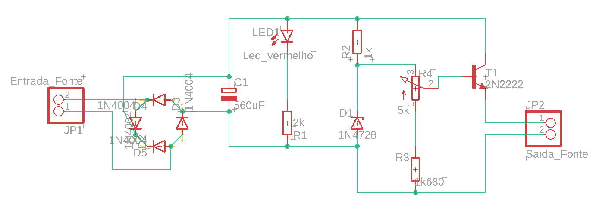
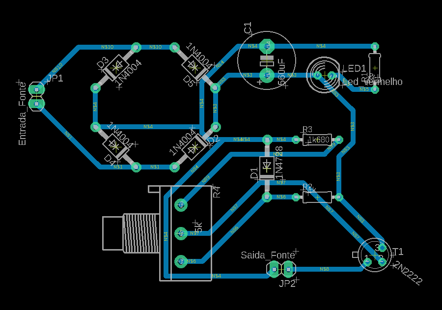

# Objetivo

Nesse projeto, realizado para a disciplina de Eletrônica para Computação do curso da USP - São Carlos, tem-se como objetivo projetar uma **Fonte de Tensão ajustável** entre **3V e 12V** com capacidade de **100mA**   

# Funcionamento 

A fonte transforma a tensão do fornecedor (127V - 220V) em corrente alternada (AC) que, posteriormente, será convertida numa tensão de corrente contínua que permite o funcionamento dos equipamentos. <bt>
  
    

**Transformador:** Converte a tensão recebida (AC) para um valor utilizável em AC.

**Ponte retificadora:** Retifica os pulsos de energia alternada para um sinal contínuo de modo a produzir uma saída polarizada DC.
  
**Filtragem:** Filtra a tensão tornando a corrente contínua.
  
**Regulação:** Regula a saída para obter uma tensão constante.
  
# Etapas 

  1. O processo se inicia com a entrada de um sinal elétrico alternado, em que a DDP será reduzida pelo transformador. Essa etapa é essencial para reduzir o sinal elétrico recebido para uma voltagem utilizável.  
  O transformador é um dispositivo composto por duas bobinas acopladas a um núcleo magnético, que nesse projeto é usado no intuito de reduzir a tensão da tomada para uma que seja utilizável de forma segura pela fonte. Sendo seu funcionamento relacionado ao princípio de indução eltromagnética, no qual a bobina primária ligada na tomada cria um campo magnético que induz uma corrente na bobina secundária. E, como as bobinas possuem quantidades diferentes de espiras, as correntes e voltagens serão diferente de cada lado, para que a potência seja constante. 
  $$Ve.Ns = Vs.Ne$$
Portanto, para transformar a voltagem de entrada (Ve) na voltagem de saída (Vs), considerando Ve > Vs, temos que a quantidade de voltas da entrada tem que ser maior que a da saída.   
   
  
  2. O próximo estágio é a retificação da enegeria alternada recebida para um sinal contínuo.
  Essa etapa é composta por uma ponte com quatro diodos que só permitem a passagem dos semiciclos positivos do sinal original, sendo essa configuração conhecida como retificador de onda completa. 
  A ponte retificadora é composta por quatro diodos colocados em pares alternados que transformam tanto a seção positiva quanto negativa da corrente AC em uma tensão polarizada DC. 
  
         
  
  3. No processo que sucede é feita a filtragem por um capacitor que carrega rapidamente e descarrega lentamente, de forma que o ruído residual, também conhecido como RIPPLE, seja o menor possível, fazendo com que o sinal pulsante fique o mais próximo possível de um sinal linear de corrente contínua.   
     
  
  4. Por último teremos a regulação. Nessa etapa, iremos utilizar um regulador, dispositivo que funciona de forma a linearizar o máximo possível a saída da fonte na tensão desejada, retirando o RIPPLE ainda deixado pelo capacitor na etapa anterior. Dessa forma, por mais que entre uma tensão pulsante ou com o valor superior ao desejado, na entrada do regulador, esse irá apresentar em sua saída uma tensão de valor constante e fixo. 
  Para o projeto, o regulador será composto por um resistor e um diodo zener, conectado ao contrário, em que o resistor irá reduzir a corrente que chega no diodo, para não danificá-lo, que, após uma tensão zener aplicada, irá permitir apenas este valor de tensão passar, barrando o excedente e oferecendo uma corrente contníua. 
  Para o projeto os valores escolhidos para o diodo Zener, classificado por sua tensão de ruptura e potência máxima, foram de 13V e 1W, de acordo com a especificação do trabalho.   
  
   
     
  
# Cálculos 

Tensão de pico da fonte:
$$V_{fonte-pico} = \sqrt2 * 127 = 180 V$$

Tensão rms medido:
$$V_{rms} = 16,6 V (medido)$$

Tensão de pico:
$$V_{pico} = \sqrt2 * V_{rms} = 23.47 V$$

Cálculo da razão:
$$razão = \frac{V_{pico}}{V_{fonte-pico}} = 7.65 $$

Após ponte de diodos (subtraindo 0.7 * 2 V):
$$V_{s-ponte} = V_{pico} - 2 * 0.7 = 22.07 V$$

Valor do ripple (10% da voltagem que chega ao capacitor):
$$V_{ripple} = 0.1 * V_{s-ponte} =  2.20 V$$
$$V_{s} = V_{s-ponte} - \frac{v_{ripple}}{2} = 20.97 V$$

Dos dados do Falstad, na configuração de 3V, utilizando um resistor de $2k\Omega$ :
$$i_{transistor-base} = 0.23mA$$
$$V_{r-baixo} = 3.4 V$$
$$i_{r-baixo} = \frac{V_{r-baixo}}{2000} = 1.7 mA$$
$$R_{pot} = \frac{13 - 3.4}{i_{r-baixo} + i_{transistor-base}} = 4,97 k\Omega$$
Valor comercial escolhido: $R_{pot} = 5 k\Omega$

Na configuração de 3V e utilizando um resistor de $1k\Omega$ antes do zener, a corrente que passa por ela é máxima. Como o zener utilizado possui especificações de 1W e 13V:
$$i_{zmax} = \frac{P_z}{V_z} = 76.92mA$$
Pelos dados do Falstad, a corrente máxima é igual a $7.4mA$, o que é bem abaixo do máximo permitido.

Para a resistência do LED, foi escolhido o valor de $2k\Omega$, pois assim passa uma quantidade de corrente abaixo do limite.

O $I_0$ (para o calculo do valor do capacitor), pelo Falstad, é igual a:
$$I_0 = 120.96 mA$$

Cálculo da capacitância, onde $f = 2* 60 = 120 Hz$ (já que a frequência de saída é o dobro da entrada para uma retificação de onda completa em ponte):
$$C = \frac{I_0}{V_{ripple} * f} = 480\micro F$$
Valor comercial escolhido: $C = 560\micro F$

# Valores 

| Quantidade | Componente | Valor uni. | Valor Tot|
|--------------|------------|-------|--------|
| 06 | Diodo Retificador 10A10 | 0,99 | 5,94 |
| 02 | Capacitor 560μF25V | 0,95 | 1,90 |
| 04 | Diodo Zener 13V 1W 1N4743 | 0,23 | 0,92 |
| 10 | Resistor 1K 5% 14W | 0,04 | 0,4 |
| 10 | Resistor 1K8 5% 2W | 0,04 | 0,4 |  
| 04 | Resistor 2K 5% 14W | 0, 05 | 0,2 |
| 04 | Transistor npn 2N2222 | 0,5 | 2,00 |    
| 01 | Potenciômetro linear 5K | 1,99 | 1,99 |
| 03 | Led 5mm vermelho | 0,15 | 0,45 |
|**Total:** | | | **38,20** |

  
# Circuito no Falstad 

   

Link do circuito: https://tinyurl.com/28emweqm   

# Esquemático no EAGLE

  

# PCB no EAGLE

  

# Fontes de pesquisa 

Aulas do Professor Simões: https://gitlab.com/simoesusp/disciplinas/-/tree/master/SSC0180-Eletronica-para-Computacao
https://electronicsclub.info/powersupplies.htm 
 
# Responsáveis 

Shogo Shima - 12675145  
Jesus Sena Fernandes -  
Letícia Raddatz Jönck - 14589066   
Pietra Gullo Salgado Chaves - 14603822 
José Carlos -  
